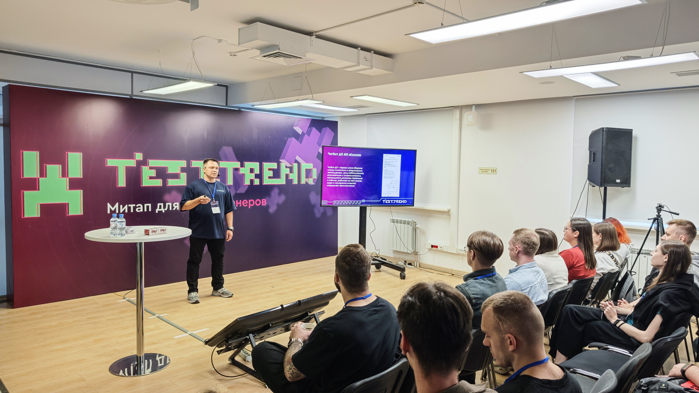
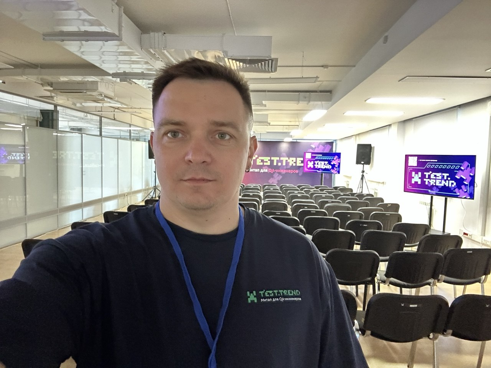
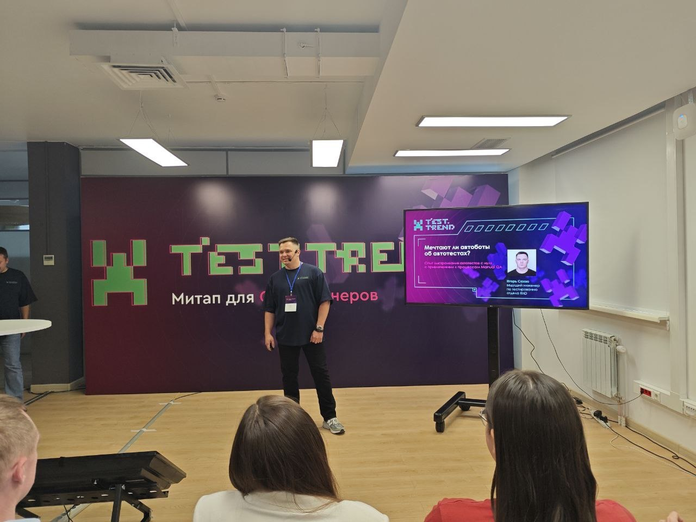

# Igor Sakhno

### Senior / Full-Stack QA Engineer

QA Automation · Python · AI · FinTech · Distributed Systems

7+ years of experience in software testing and quality engineering,
with a strong focus on test automation, backend and API testing,
distributed systems, and AI-powered products.

I build and maintain test automation frameworks, work with complex
integrations and asynchronous systems, and focus on improving not only
test coverage but the overall quality engineering process.

---

## 👨‍💻 About Me

- 7+ years in QA and software testing
- Strong commercial experience with Python and test automation
- Backend, API and integration testing
- Experience with distributed systems and Kafka-based integrations
- Experience testing AI-powered products
- Automation framework design and development
- CI/CD and automated test execution
- Experience working in international and multicultural engineering teams
- Technical speaker and contributor to the QA community

---

## 🛠️ Core Expertise

### Testing

Manual Testing · Automation Testing · API Testing · Integration Testing ·
Regression Testing · Exploratory Testing · Test Design

### Automation

Python · Pytest · Playwright · REST API · UI Automation ·
Automation Frameworks

### Backend & Infrastructure

REST · Kafka · SQL · Docker · Linux · CI/CD · Git

### AI

AI Product Testing · LLM-based Systems · AI-assisted Test Automation ·
Non-deterministic Systems

### Engineering

Distributed Systems · Microservices · Asynchronous Workflows ·
Test Architecture · Quality Engineering

---

## 🤖 AI & LLM Testing

Practical experience testing AI-powered systems, including
LLM-based services, NLU/NLP components and RAG-based systems.

Areas of experience include:

- LLM-based systems
- NLU / NLP testing
- Entity recognition
- RAG-based systems
- Non-deterministic output validation
- AI-generated test data
- AI-assisted test automation
- API and integration testing
- Kafka-based integrations
- Prompt engineering

---

## 🎤 Public Speaking & QA Community

I actively share my experience with the QA community through
technical talks, conference presentations and professional discussions.

### Conference Talks

#### Python Playwright Framework from Scratch

Technical presentation focused on designing and building a
test automation framework from scratch.

[Presentation — PDF](./presentations/Python_Playwright_Framework.pdf)

[Presentation — PPTX](./presentations/Python_Playwright_Framework.pptx)

[LinkedIn / Conference publication](https://lnkd.in/p/diNFJ6gN)

[LinkedIn / Conference publication](https://lnkd.in/p/dYBKcT63)

[LinkedIn / Conference publication](https://lnkd.in/p/dCKjQp_G)

---

### 📸 Conference Highlights

Some moments from my technical talks and QA community activities.

  
  
  

## 🚀 Selected Projects

### Telegram Bot Platform

A collection of Python-based Telegram bots demonstrating
backend development, API integrations, database design and
automation-oriented engineering practices.

[View project→](./projects/telegram-bots.md)

### Raspberry Pi HomeLab

A personal infrastructure project focused on self-hosting,
Docker, networking, monitoring and automation.

[View project→](./projects/raspberry-homelab.md)

### AI Testing

Experiments and practical work related to testing
AI-powered and LLM-based systems.

[View project→](./projects/ai-testing.md)

## 📫 Contact

LinkedIn: [Igor Sakhno](https://www.linkedin.com/in/igor-sakhno/)

GitHub: [igor-sakhno](https://github.com/i-sakhno)

Telegram: [@Igor_S_QA →](https://t.me/Igor_S_QA)